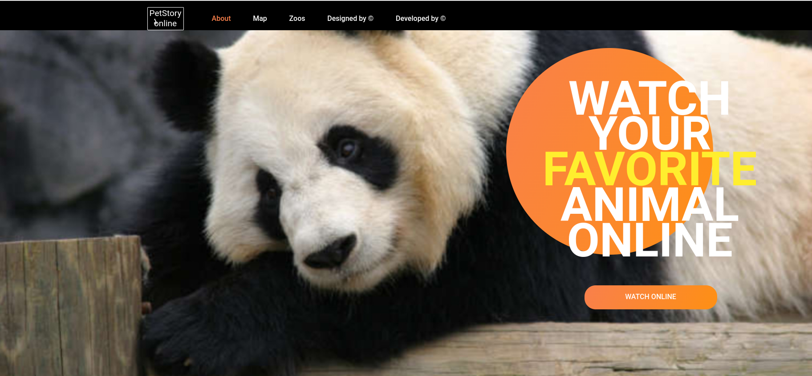
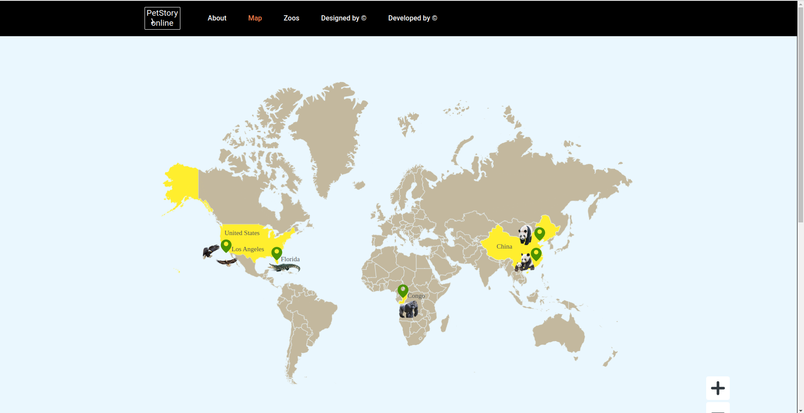
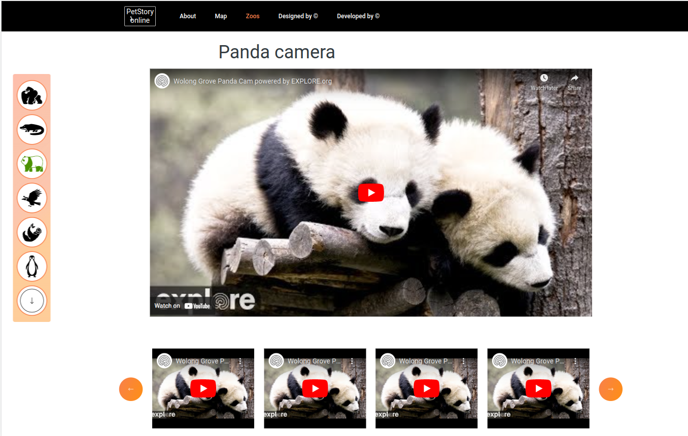
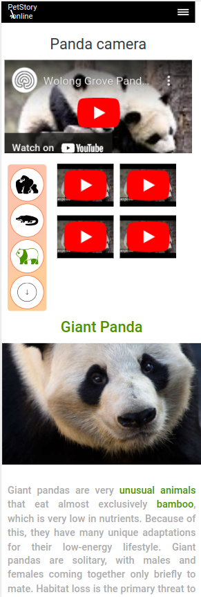

# Project name: Online zoo

_**Online zoo** is basically a website created to simulate a visit to a zoo, and the visitors to this site can view exhibits about animals and their habitats. Many Zoos as well as schools have developed virtual zoos. For example, a virtual zoo will have articles, vieos and photos as exhibits instead of actual animals._

[Demo](https://oxanadanilova.github.io/online-zoo-ts/)

---

---

## Description

This is the [Rolling Scopes School](https://rs.school/index.html) studing project.
It was designed by Alisa Samborskaya ([design in Figma](https://www.figma.com/file/jfEFwkXVj1WRq7sUHDr8os/PetStory-online?node-id=0%3A1)) and developed by [Oxana Danilova](https://github.com/OxanaDanilova)

---

## Technologies

HTML5,SCSS, JavaScript, React, TypeScript, Flexbox Layout, Grid Layout, Responsive design, React Router v6

---

## Contact

[Oxana Danilova](https://www.linkedin.com/in/oxana-danilova-b082a0156/)

---

Made with ❤️
